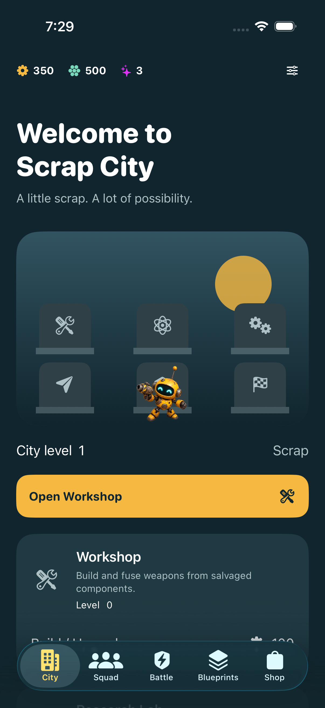
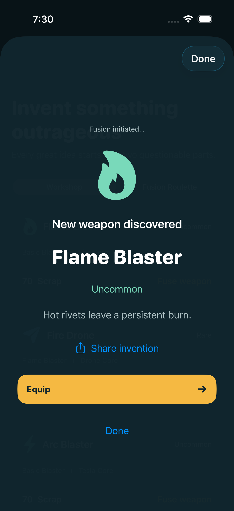
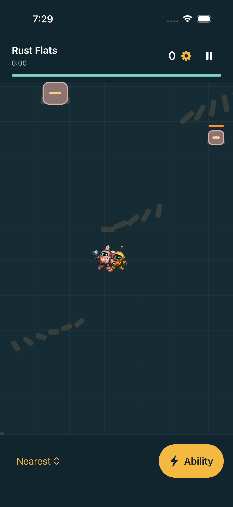

# Verified GitHub Xcode build — 3 October 2026

The [Validate native game run #4](https://github.com/lanray07/Scrap-Squad/actions/runs/37147738498) completed successfully for source commit `e2ab702b08cd75fbbad4fa71fb628f2666c94a92`.

| Check | Result |
| --- | --- |
| Xcode 26.6 iOS simulator compilation | Passed |
| Swift gameplay tests on macOS | 14 passed |
| Python localization tests | 8 passed |
| Source catalog references / store draft limits | Passed |
| Onboarding → city → workshop → Flame Blaster fusion | Passed on iPhone 17 Pro / iOS 26.5 |
| Battle navigation → deployment → pause → retreat → return | Passed on iPhone 17 Pro / iOS 26.5 |
| Actual simulator screenshots | Exported and visually inspected |

## Artifacts

- [Simulator app package](https://github.com/lanray07/Scrap-Squad/actions/runs/37147738498/artifacts/11282972667)
- [Simulator screenshots and test attachments](https://github.com/lanray07/Scrap-Squad/actions/runs/37147738498/artifacts/11282737176)
- [Xcode logs and result bundles](https://github.com/lanray07/Scrap-Squad/actions/runs/37147738498/artifacts/11283181725)

The downloaded zip was inspected: bundle identifier `com.scrapsquad.mergeandsurvive`, minimum iOS version 17.0, device families iPhone and iPad, executable plus the robot atlas, compiled asset catalog, gameplay resource bundle and English localization are present.

## SDK and launch fixes

The GitHub runner found issues that Windows syntax checks could not detect. StoreKit transactions are now fully qualified, the Game Center delegate dispatches dismissal to the main actor, leaderboard submission uses `GKLocalPlayer.local`, and the startup error label uses the supported localized initializer.

Simulator launch also exposed a missing SwiftUI environment dependency. Shared game/commerce/Game Center state is now injected above presentation modifiers, and both smoke tests pass after this fix. The workflow saves the compiled app before UI testing and keeps boot/test diagnostics even when a test fails. Simulator tests use one device and a ten-minute step timeout.

## Actual captures

These are real simulator captures from the passing run, not generated marketing screenshots:

The inspected captures show the expected native controls, generated character art, real recipe reveal and SpriteKit battle arena. This smoke pass does not certify iPad layout, iOS 17 runtime behavior, VoiceOver, the full two-minute mission UI path, long-running performance or store-service integration. Those checks remain in RELEASE.md.

The validation workflow produces an unsigned simulator build. A separate manual `release.yml` workflow now uses the existing Apple API/team secrets and cloud distribution signing. Its [successful run 3](https://github.com/lanray07/Scrap-Squad/actions/runs/37152648395) uploaded version 1.0, build 3 with bundle ID `com.ScrapSquad.app`. No development-device registration was needed. The earlier simulator artifact described above used the old development bundle identifier.
